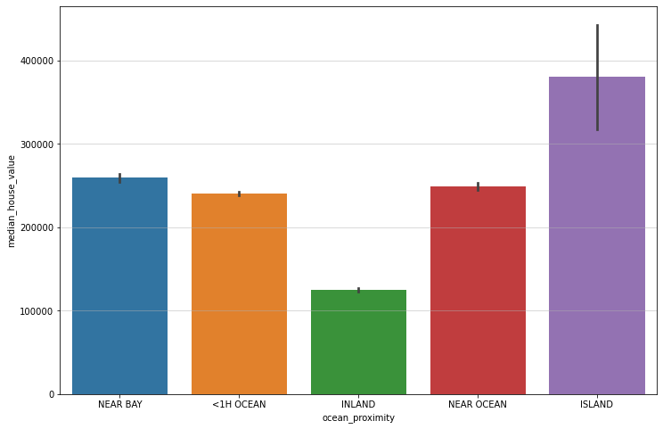

# 🏠 California Housing Data Analysis

This project provides a comprehensive analysis and visualization of the California housing dataset using Python, including:

* Data cleaning and feature engineering
* Statistical summaries and correlations
* Geospatial visualizations with GeoPandas
* Outlier detection and removal
* Machine learning preprocessing

---

## 1️⃣ Import Libraries

### 📦 **Import Libraries**

```python
import pandas as pd
import numpy as np
import seaborn as sns
import matplotlib.pyplot as plt
import geopandas as gpd
```

---

## 2️⃣ Load Dataset

### 📂 **Load the `housing.csv` file**

```python
df = pd.read_csv('housing.csv')
```

---

## 3️⃣ Data Cleaning and Feature Engineering

### 🧹 **Drop Missing Values**

```python
df.dropna(inplace=True)
```

### 🧮 **Compute rooms per household**

```python
df['rooms_per_household'] = df['total_rooms'] / df['households']
```

### 🧮 **Compute population per household**

```python
df['population_per_household'] = df['total_rooms'] / df['population']
```

---

## 4️⃣ Statistical Analysis

### 📊 **Average house value for homes <= 50 years**

```python
housing_median_age_lessEqual50 = df.loc[(df['housing_median_age'] <= 50), 'median_house_value']
housing_median_age_lessEqual50.mean()
```

### 🔗 **Calculate correlation with house value**

```python
median_house_correlation = df.corr()[['median_house_value']]
```
```python
median_house_correlation.sort_values(by='median_house_value', inplace=True)
```
```python
plt.figure(figsize=(4, 8))
sns.heatmap(median_house_correlation, annot=True, cmap='rocket')
plt.title('\'median_house_value\' Correlation Matrix Heatmap', pad=20, fontsize=15)
```


### 🔍**Comment on Correlations**
This heatmap visualizes the **correlation between various housing features and `median_house_value`** in the California housing dataset.

* **Strongest Positive Correlation:**

  * `median_income` has a high positive correlation of **+0.69** with house value.

    > 💡 This means areas with higher median income tend to have significantly higher house prices.

* **Moderate Positive Correlations:**

  * `population_per_household` (+0.21), `rooms_per_household` (+0.15), and `total_rooms` (+0.13) show mild positive relationships.
  * These suggest that more crowded or larger households are slightly associated with higher house values.

* **Weak or Near-Zero Correlations:**

  * `population`, `total_bedrooms`, and `households` have negligible influence individually on house value.

* **Negative Correlations:**

  * `latitude` (-0.14) and `longitude` (-0.045) have negative correlations.

    > 📍 This indicates some **geographic trend** — likely, locations further south or inland have lower house values.

---

## 5️⃣ Visualization and Geospatial Analysis

### 📈 **Regression Plot: Income vs House Value**

```python
plt.figure(figsize=(12, 8))
sns.jointplot(x='median_income', y='median_house_value', data=df, kind='reg', line_kws={'color': 'red'}, height=8)
```


### 🗺 **Scatterplot with Spatial Reference**

```python
gdf = gpd.read_file('ca_state.zip')
gdf.to_crs(4326, inplace=True)
```

```python
axis = gdf.plot(figsize=(10,12), color='lightgray', edgecolor='black', alpha=0.3)
sns.scatterplot(
    ax=axis,
    data=df,
    x='longitude',
    y='latitude',
    hue='median_house_value',
    size='population',
    palette='coolwarm',
    edgecolor='black',
    sizes=(20,250),
    alpha=0.6,
)
axis.set_title('Median House Value and Population', fontsize=16)
axis.set_xlabel('Longitude', fontsize=12)
axis.set_ylabel('Latitude', fontsize=12)
plt.legend(fontsize=12, bbox_to_anchor=(1, 1), loc='upper left')
```


---

## 6️⃣ Feature Transformation

### 💰 **Categorize Income**

```python
q1 = df['median_income'].quantile(0.25)
q2 = df['median_income'].quantile(0.5)
q3 = df['median_income'].quantile(0.75)
at95 = df['median_income'].quantile(0.95)
```

```python
df['income_cat'] = pd.Series(dtype='object')
```

```python
df.loc[df['median_income'] < q1, 'income_cat'] = 'Low'
df.loc[(df['median_income'] >= q1) & (df['median_income'] < q2), 'income_cat'] = 'Below average'
df.loc[(df['median_income'] >= q2) & (df['median_income'] < q3), 'income_cat'] = 'Above average'
df.loc[(df['median_income'] >= q3) & (df['median_income'] < at95), 'income_cat'] = 'High'
df.loc[df['median_income'] >= at95, 'income_cat'] = 'Very high'
```

---

## 7️⃣ Data Visualization by Category

### 📊 **Histogram of Income Category by Ocean Proximity**

```python
plt.figure(figsize=(12, 8))
sns.histplot(data=df.sort_values(by='median_income'), x='income_cat', hue='ocean_proximity', multiple='dodge')
plt.grid(True, alpha=0.6, axis='y')
```


### 📉 **Bar Plot: Income Category vs House Value**

```python
plt.figure(figsize=(12, 8))
plt.grid(True, alpha=0.6, axis='y')
sns.barplot(x='income_cat', y='median_house_value', data=df.sort_values(by='median_income'))
```


### 🌊 **Bar Plot: Ocean Proximity vs House Value**

```python
plt.figure(figsize=(12, 8))
sns.barplot(x='ocean_proximity', y='median_house_value', data=df)
plt.grid(True, alpha=0.6, axis='y')
```



### 🔥 **Heatmap: Income Category vs Ocean Proximity**

```python
heatmap_df = df[['ocean_proximity','income_cat','median_house_value']]
groups = heatmap_df.groupby(['ocean_proximity','income_cat'])

df_list = []
for i in groups.groups:
    df_list.append([i[0], i[1], groups.get_group(i)['median_house_value'].mean()])

heatmap_df = pd.DataFrame(df_list, columns=['ocean_proximity','income_cat','median_house_value'])
heatmap_df = heatmap_df.pivot('income_cat', 'ocean_proximity', 'median_house_value')
heatmap_df.drop(columns=['ISLAND'], inplace=True)
heatmap_df.sort_values(by=['<1H OCEAN','INLAND','NEAR BAY','NEAR OCEAN'], inplace=True)

plt.figure(figsize=(12, 8))
sns.heatmap(heatmap_df, annot=True, fmt=".0f", linewidths=0.5)
```


---

## 8️⃣ Missing Value Imputation

### 🔁 **Reload Data and Fill Missing Values**

```python
df = pd.read_csv('housing.csv')
mean = df['total_bedrooms'].mean()
df['total_bedrooms'] = df['total_bedrooms'].fillna(mean)

median = df['total_rooms'].median()
df['total_rooms'] = df['total_rooms'].fillna(median)
```

---

## 9️⃣ Outlier Detection and Removal

### 📦 **Identify Outliers**

```python
num_df = df.select_dtypes(np.number)

plt.figure(figsize=(15, 8))
ncols = 3
num_features = len(num_df.columns)
nrows = (num_features + 1) // ncols

for i, column in enumerate(num_df.columns, 1):
    plt.subplot(nrows, ncols, i)
    sns.boxplot(x=df[column])
    plt.title(f'Boxplot of {column}')

plt.tight_layout()
plt.show()
```


### ❌ **Remove Outliers with IQR Rule**

```python
def drop_outliers(df):
    columns = df.select_dtypes(np.number)
    for col in columns:
        q1 = df[col].quantile(0.25)
        q3 = df[col].quantile(0.75)
        iqr = q3 - q1
        lower_bound = q1 - 1.5 * iqr
        upper_bound = q3 + 1.5 * iqr
        df = df.loc[(df[col] >= lower_bound) & (df[col] <= upper_bound)]
    return df

df_droped_outlier = drop_outliers(df)
```

```python
nrows = len(num_df.columns)
fig, axes = plt.subplots(nrows, 2, figsize=(15, 30))

for i, column in enumerate(num_df.columns):
    sns.boxplot(x=df[column], ax=axes[i, 0]) 
    axes[i, 0].set_title(f'{column}', fontsize=14, fontweight='bold')
    sns.boxplot(x=df_droped_outlier[column], ax=axes[i, 1])  
    axes[i, 1].set_title(f'{column}', fontsize=14, fontweight='bold')

fig.text(0.25, 0.95, 'Left: Original Data', ha='center', va='center', fontsize=16, fontweight='bold')
fig.text(0.75, 0.95, 'Right: Data with Outliers Removed', ha='center', va='center', fontsize=16, fontweight='bold')
plt.tight_layout()
fig.subplots_adjust(top=0.92, hspace=0.5)
```


---

## 🔟 Machine Learning Preprocessing

### 🧠 **Machine Learning Preprocessing**

```python
from sklearn.model_selection import train_test_split
from sklearn.preprocessing import MinMaxScaler, OneHotEncoder
from sklearn.compose import ColumnTransformer
```

```python
X = df.drop(columns=['longitude','latitude','median_house_value']) 
y = df['median_house_value']
```

```python
X_train, X_test, y_train, y_test = train_test_split(X, y, test_size=0.3)
```

```python
scaler = MinMaxScaler()
encoder = OneHotEncoder(handle_unknown='ignore')
```

```python
num = X.select_dtypes(np.number)
cat = X.select_dtypes(exclude=[np.number])
```

```python
processor = ColumnTransformer([
    ('scaler', scaler, num.columns),
    ('encoder', encoder, cat.columns)
])
```

```python
processed_X_train = processor.fit_transform(X_train)
processed_X_test = processor.transform(X_test)
processed_y_train = scaler.fit_transform(np.array(y_train.to_numpy().reshape(-1,1)))
processed_y_test  = scaler.transform(y_test.to_numpy().reshape(-1,1))
```

---

✅ Finalize transformed data ready for machine learning models.


### 👨‍💻 **Author**

**Yasser Ismail**
📍 Geospatial Engineer